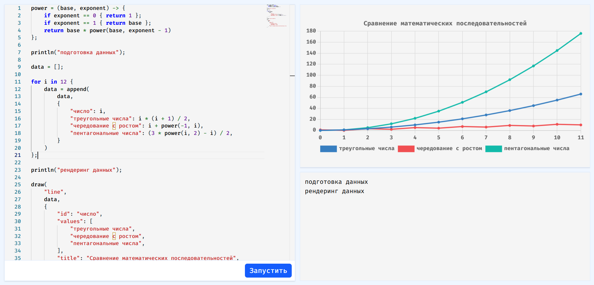

DPL — интерпретируемый язык программирования, работающий в браузере.
Интерпретатор языка компилируется в WebAssembly,
что обеспечивает высокую производительность исполнения кода на стороне клиента.
Язык поддерживает встроенные функции для визуализации данных 
и имеет удобный редактор с подсветкой синтаксиса.

